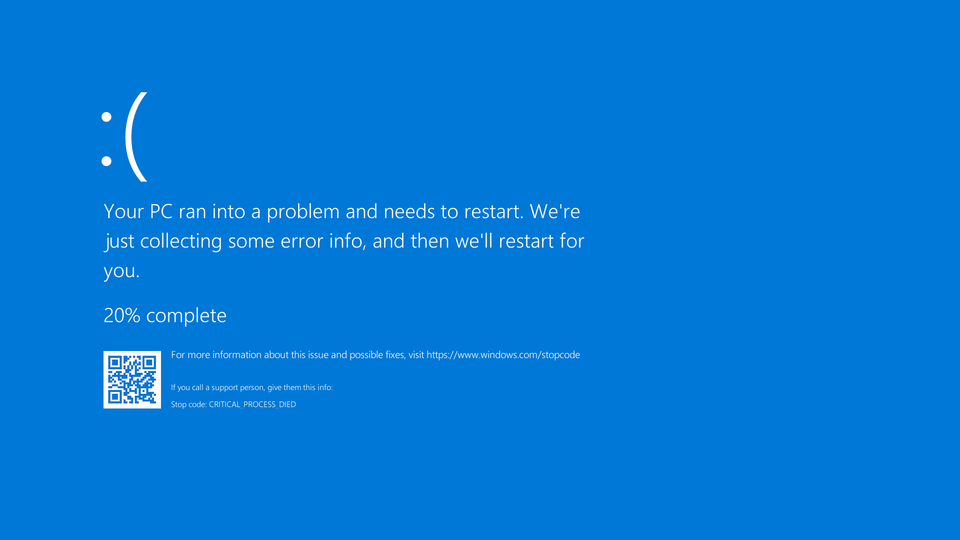
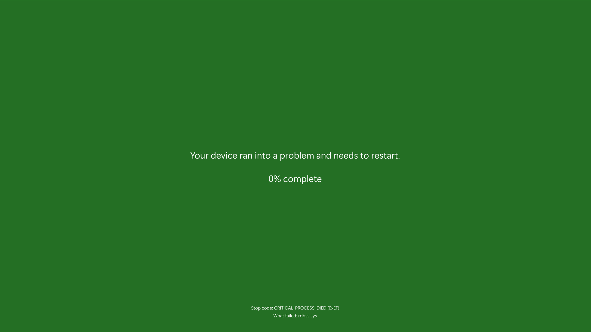

## Goodbye BSOD

Farewell to the legendary Blue Screen of Death (BSOD), whose days are numbered as Microsoft plans to simplify it, stripping away its iconic status. Though the BSOD may lose some of its character, its legacy lives on. In our repository, you can find `main` files in different programming languages that recreate the classic blue screen without harming your system - a nod to the error screen's enduring place in tech history. What's more, these solutions are themselves legendary, drawn from Stack Overflow articles over 10 years old!

### Old BSOD

### New BSOD

###### As a reminder, for Windows Insiders this appears as a “green screen”, but the design will look like this
